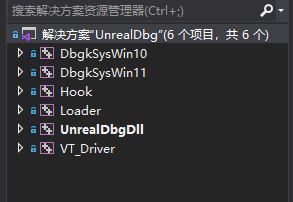
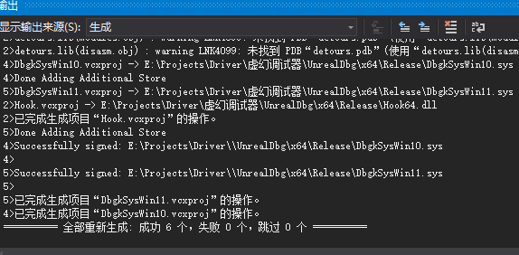

# 如何编译该项目
编译器：VS2019
SDK: 10.0.019041或最新版本
WKD: WDK10

打开UnrealDbg.sln然后直接编译就行了，注意，需要编译64位版本 UnrealDbgDll只能编译release版本，至于UI则是UnrealDbg项目，使用delphi打开即可

打开nrealDbg.sln后如下图所示



然后直接在解决方案上点生成即可（你也可以单独编译某个项目）




# UnrealDbg 项目详细介绍


本项目是一个基于 VT（Intel Virtualization Technology）技术构建的调试体系，旨在突破游戏驱动的反调试机制。项目的用户界面使用 Delphi 编写，提供了直观、便捷的操作体验；核心代码则采用 C++ 编写，利用 VT 技术的强大功能实现对游戏驱动的调试。
在游戏外挂开发过程中，游戏驱动的反调试机制常常给调试工作带来巨大的挑战。传统的调试工具往往无法突破这些反调试机制，导致调试工作难以进行。本项目通过利用 VT 技术，实现了一个独立的调试体系，能够绕过游戏驱动的反调试机制，为开发者和安全测试人员提供了一种有效的调试手段。

突破反调试机制：利用 VT 技术，绕过游戏驱动的反调试机制，实现对游戏驱动的调试。
自建调试体系：构建了一个独立的调试体系，不依赖于传统的调试工具，提高了调试的灵活性和可靠性。
直观的用户界面：使用 Delphi 编写的用户界面，提供了直观、便捷的操作体验，方便用户进行调试操作。
C++ 核心代码：采用 C++ 编写的核心代码，利用 VT 技术的强大功能，实现了高效、稳定的调试功能。

## 一、项目概述
UnrealDbg 是一个旨在突破游戏驱动反调试机制的自建调试体系项目，采用 Delphi 和 C++ 混合编程，支持 Windows 10 和 Windows 11 操作系统。该项目通过 VT（Intel Virtualization Technology）技术，构建了一套完整的调试解决方案，涵盖卡密注册、加密、调试、加载、钩子等多个功能模块。

## 二、项目结构及各模块详细分析

### （一）UnrealDbg 主项目
该文件夹是项目的核心目录，包含与基于 VT 技术的自建调试体系相关的主要代码和资源，采用 Delphi 进行开发。
- **项目文件**：
    - `UnrealDbg.dpr`：Delphi 项目的主程序文件，是程序的入口点。
    - `UnrealDbg.dproj`：Delphi 项目的配置文件，包含编译选项、依赖项等信息。
    - `UnrealDbg.dproj.local`：本地项目配置文件，用于存放开发者本地的个性化配置。
    - `UnrealDbg.res`：Delphi 资源文件，包含图标、菜单等资源信息。
- **子文件夹**：
    - **Forms**：存放 Delphi 窗体文件，定义用户界面布局和交互逻辑。例如 `Main.dfm` 和 `Main.pas` 可能定义了调试工具的主界面。
    - **Globals**：包含全局变量的定义文件，如 `GlobalVar.pas`，用于在整个项目中共享数据。
    - **Network**：涉及网络相关功能，如 `KeyVerification.pas` 可能用于卡密的验证，通过网络与服务器进行交互。
    - **ExternalCall**：包含与外部 DLL 交互的代码，如 `D_encryptionDll.pas` 和 `UnrealDbgDll.pas`，用于调用加密 DLL 和调试核心 DLL 的功能。
    - **LogSystem**：负责日志记录，如 `Log.pas` 可能实现了日志的写入和管理功能。
    - **Handler**：可能包含各种事件处理程序，用于处理用户操作和系统事件。
    - **Common**：包含项目中多个子项目共享的代码、头文件、工具类等。
    - **KernelApi**：涉及内核级别的 API 调用，用于与操作系统内核进行交互。
    - **Threads**：包含多线程相关的代码，用于实现并发操作，提高程序的性能和响应速度。
    - **res**：存放资源文件，如图标、图片等。

### （二）CardRegistration 模块
用于卡密注册功能的实现，提供用户界面让用户输入和验证卡密。
- **核心文件**：
    - `卡密注册.dpr`：Delphi 项目主程序文件，包含程序入口点。
    - `卡密注册.dproj`：Delphi 项目配置文件，包含编译选项、依赖项等信息。
    - `卡密注册.dproj.local`：本地项目配置文件，包含开发者本地个性化配置。
    - `卡密注册.res`：Delphi 资源文件，包含图标、菜单等资源信息。
- **功能实现**：通过与服务器进行交互，验证用户输入的卡密是否有效，确保只有合法用户能够使用调试工具。

### （三）D - encryption 模块
与加密功能相关，用于对数据进行加密处理，保障数据的安全性。
- **核心文件**：
    - `D_encryption.dpr`：Delphi 项目主程序文件，包含程序入口点。
    - `D_encryption.dproj`：Delphi 项目配置文件，包含编译选项、依赖项等信息。
    - `D_encryption.dproj.local`：本地项目配置文件，包含开发者本地个性化配置。
    - `D_encryption.res`：Delphi 资源文件，包含图标、菜单等资源信息。
- **加密算法**：可能使用了 Blowfish 等加密算法，对敏感数据（如卡密、调试信息等）进行加密。

### （四）DbgkSysWin10 和 DbgkSysWin11 模块
分别针对 Windows 10 和 Windows 11 系统设计的调试相关模块，提供一系列用于调试操作的接口和功能实现，有助于突破游戏驱动反调试机制。
- **核心文件**：
    - `DbgkApi.h` 和 `DbgkApi.cpp`：定义并实现调试相关的 API 函数，如 `NtCreateDebugObject`、`NtDebugActiveProcess` 等，用于创建调试对象、激活调试进程等操作。
    - `Driver.h` 和 `Driver.cpp`：驱动程序核心文件，`DriverEntry` 负责驱动初始化，`Unload` 负责清理资源。
    - `Globals.h` 和 `Globals.cpp`：定义和管理全局变量。
    - `Memory` 文件夹：包含内存读写相关代码，用于实现对内存的读取和写入操作，如读取游戏进程的内存数据。
    - `Asm` 文件夹：包含汇编代码文件，用于实现高性能或底层操作，如修改 CPU 寄存器的值。
    - `Hooks` 文件夹：特别是 `EptHook` 子文件夹，用于实现钩子功能，拦截系统或目标进程的特定操作，如函数调用、系统调用等。
    - `Init` 文件夹：包含初始化相关代码，如符号解析和初始化，确保调试工具能够正确识别和处理系统符号。
    - `Encrypt` 文件夹：特别是 `Blowfish` 子文件夹，可能用于实现加密功能，对调试数据进行加密传输。
    - `Log` 文件夹：包含日志相关代码，用于记录调试过程中的信息，方便开发者进行问题排查。
    - `List` 文件夹：包含链表相关代码，用于实现链表数据结构，管理调试对象、进程信息等。
    - `Hvm` 文件夹：包含虚拟机相关代码，用于实现与虚拟机的交互，通过 VT 技术创建虚拟机环境，绕过游戏驱动的反调试机制。

### （五）Loader 模块
推测用于加载其他模块、驱动或程序，如加载游戏驱动、调试模块或其他必要组件，以实现调试功能。可能通过调用 Windows API 函数（如 `LoadLibrary`）来加载 DLL 文件。

### （六）Hook 模块
实现钩子技术，拦截系统或目标进程的特定操作，如函数调用、系统调用等，并在操作执行前后插入自定义代码，用于绕过游戏驱动的反调试机制。可能的实现方式包括 EPT 钩子和函数钩子。
- **核心文件**：
    - `dllmain.h`：定义了钩子相关的函数和变量，如 `SetupHook` 用于设置钩子，`UnHook` 用于卸载钩子。
    - `detours.h`：包含 Detours 库的相关定义，Detours 是一个用于函数拦截和替换的库，可用于实现钩子功能。

### （七）VT_Driver 模块
### VT_Driver 项目概述
VT_Driver 是一个基于 Intel VT（Virtualization Technology）技术的驱动程序项目，旨在利用虚拟化技术创建虚拟机环境，实现绕过游戏驱动反调试机制，为调试游戏驱动提供便利。该项目采用 C++ 语言编写，与操作系统内核紧密交互，实现了一系列复杂的功能，包括虚拟机管理、内存虚拟化、钩子技术、调试事件处理等。
绕过反调试机制：VT_Driver模块基于 Intel VT（Virtualization Technology）技术，通过创建虚拟机环境，能够绕过游戏驱动的反调试机制。这使得开发者在调试游戏驱动时，可以更方便地对其进行分析和修改，找出游戏中存在的问题，例如性能瓶颈、逻辑错误等。
多系统适配调试：DbgkSysWin11和DbgkSysWin10模块分别针对 Windows 11 和 Windows 10 系统开发，确保在不同版本的操作系统上都能实现有效的调试功能。

### 项目文件结构分析
- **核心文件**：
    - `Driver.cpp`：驱动程序的入口文件，包含 `DriverEntry` 和 `Unload` 函数，负责驱动的初始化和卸载操作。
    - `EPT.cpp`：实现了扩展页表（EPT）相关的功能，如 EPT 钩子、内存映射管理等，用于实现内存虚拟化和钩子技术。
    - `vmexit_handler.cpp`：处理虚拟机退出事件，根据不同的退出原因执行相应的操作，如中断注入、指令调整等。
    - `vmcall_handler.cpp`：处理 `VMCall` 指令，根据不同的 `VMCall` 原因执行相应的功能，如 EPT 钩子操作、断点设置等。
- **头文件**：
    - `Driver.h`：定义了驱动程序的一些常量、函数原型和数据结构，如 `IOCTL` 码、日志输出宏等。
    - `vmexit_handler.h`：定义了虚拟机退出原因的枚举类型、VM 退出指令信息的联合体，以及处理函数的原型。
    - `vmcall_reason.h`：定义了 `VMCall` 的原因枚举类型，用于区分不同的 `VMCall` 功能。

### 关键代码分析

#### 1. `DriverEntry` 函数（`Driver.cpp`）
```cpp
EXTERN_C
NTSTATUS DriverEntry(_In_ PDRIVER_OBJECT DriverObject, _In_ PUNICODE_STRING RegistryPath)
{
    UNREFERENCED_PARAMETER(DriverObject);
    UNREFERENCED_PARAMETER(RegistryPath);

    DriverObject->DriverUnload = Unload;
    KdPrint(("DriverEntry!!!\n"));

    NTSTATUS nStatus = STATUS_SUCCESS;

    if (InitNtoskrnlSymbolsTable())
    {
        if (!hv::virtualization_support()) {
            outDebug("VMX operation is not supported on this processor.\n");
            return STATUS_UNSUCCESSFUL;
        }

        hv::InitGlobalVariables();
        if (vmm_init() == false)
        {
            hv::disable_vmx_operation();
            free_vmm_context();
            outDebug("Vmm initialization failed");
            return STATUS_UNSUCCESSFUL;
        }
        outDebug("�������سɹ�!!!\n");
    }
    else
    {
        nStatus = STATUS_UNSUCCESSFUL;
        outDebug("��������ʧ��!!!\n");
    }
    return nStatus;
}
```
- **功能**：驱动程序的入口点，负责初始化驱动程序并启动虚拟机监视器（VMM）。
- **详细步骤**：
    1. 设置驱动的卸载函数为 `Unload`。
    2. 调用 `InitNtoskrnlSymbolsTable` 函数初始化 Ntoskrnl 符号表。
    3. 检查处理器是否支持 VT 技术，如果不支持则输出错误信息并返回失败状态。
    4. 初始化全局变量，调用 `vmm_init` 函数启动 VMM。
    5. 如果 VMM 初始化失败，关闭 VT 操作并释放相关资源，输出错误信息并返回失败状态。
    6. 如果所有操作成功，输出成功信息并返回成功状态。

#### 2. `vmexit_handler` 函数（`vmexit_handler.cpp`）
```cpp
EXTERN_C
bool vmexit_handler(guest_context* guest_registers, PFXSAVE64 fxsave)
{
    __vcpu* vcpu = reinterpret_cast<__vcpu*>(_readfsbase_u64());

    guest_registers->rsp = hv::vmread(GUEST_RSP);

    vcpu->vmexit_info.reason = hv::vmread(VM_EXIT_REASON) & 0xffff;
    vcpu->vmexit_info.qualification = hv::vmread(EXIT_QUALIFICATION);
    vcpu->vmexit_info.guest_rflags.all = hv::vmread(GUEST_RFLAGS);
    vcpu->vmexit_info.guest_rip = hv::vmread(GUEST_RIP);
    vcpu->vmexit_info.instruction_length = hv::vmread(VM_EXIT_INSTRUCTION_LENGTH);
    vcpu->vmexit_info.instruction_information = hv::vmread(VM_EXIT_INSTRUCTION_INFORMATION);
    vcpu->vmexit_info.guest_registers = guest_registers;
    vcpu->vmexit_info.fxsave = fxsave;

    vcpu->hide_vm_exit_overhead = false;
    dispatch_vm_exit(vcpu);

    if (vcpu->vmx_off_state.vmx_off_executed == true)
    {
        vcpu->vcpu_status.vmm_launched = false;
        RestoreGuest();
        return true;
    }

    return false;
}
```
- **功能**：处理虚拟机退出事件，根据退出原因执行相应的操作。
- **详细步骤**：
    1. 通过 `_readfsbase_u64` 函数获取当前 VCPU 的指针。
    2. 从 VMCS 中读取相关信息，如 `GUEST_RSP`、`VM_EXIT_REASON` 等，并存储在 `vcpu->vmexit_info` 结构体中。
    3. 调用 `dispatch_vm_exit` 函数根据退出原因进行分发处理。
    4. 如果检测到 `VMXOFF` 操作已执行，将 VMM 启动状态设置为 `false`，恢复 Guest 状态，并返回 `true` 表示需要停止处理。
    5. 否则返回 `false` 继续处理。

#### 3. `vmexit_vmcall_handler` 函数（`vmcall_handler.cpp`）
```cpp
void vmexit_vmcall_handler(__vcpu* vcpu)
{
    bool status = true;
    unsigned __int64 vmcall_reason = 0;
    unsigned __int64 vmcall_parameter1 = 0;
    // ... 其他参数定义

    if ((vcpu->vmexit_info.guest_registers->rax != VMCALL_IDENTIFIER) &&
        (vcpu->vmexit_info.guest_registers->eax != VMCALL_IDENTIFIER2))
    {
        if (ept::handler_vmcall_rip(*vcpu->ept_state))
        {
            return;
        }
        hv::inject_interruption(EXCEPTION_VECTOR_UNDEFINED_OPCODE, INTERRUPT_TYPE_HARDWARE_EXCEPTION, 0, false);
        return;
    }

    if (vcpu->vmexit_info.guest_registers->eax == VMCALL_IDENTIFIER2)
    {
        vmcall_reason = vcpu->vmexit_info.guest_registers->ecx;
        vmcall_parameter1 = vcpu->vmexit_info.guest_registers->edx;
    }
    else
    {
        vmcall_reason = vcpu->vmexit_info.guest_registers->rcx;
        vmcall_parameter1 = vcpu->vmexit_info.guest_registers->rdx;
        // ... 其他参数赋值
    }

    switch (vmcall_reason)
    {
    case VMCALL_TEST:
        adjust_rip(vcpu);
        break;
    case VMCALL_VMXOFF:
        call_vmxoff(vcpu);
        adjust_rip(vcpu);
        break;
    // ... 其他 case 分支
    }

    vcpu->vmexit_info.guest_registers->rax = status;
}
```
- **功能**：处理 `VMCall` 指令，根据不同的 `VMCall` 原因执行相应的操作。
- **详细步骤**：
    1. 检查 `VMCall` 是否属于本驱动程序，如果不是则尝试处理 `VMCall RIP` 钩子，若失败则注入未定义操作码异常。
    2. 根据 `VMCall` 的标识符（`VMCALL_IDENTIFIER` 或 `VMCALL_IDENTIFIER2`）获取 `VMCall` 原因和参数。
    3. 使用 `switch` 语句根据 `VMCall` 原因进行不同的处理，如 `VMCALL_TEST` 调整指令指针，`VMCALL_VMXOFF` 调用 `call_vmxoff` 函数退出 VMX 模式等。
    4. 将处理结果存储在 `vcpu->vmexit_info.guest_registers->rax` 中。

### 项目功能总结
- **虚拟机管理**：通过 `DriverEntry` 函数初始化和启动 VMM，利用 `vmexit_handler` 函数处理虚拟机退出事件，实现对虚拟机的有效管理。
- **内存虚拟化**：`EPT.cpp` 文件实现了 EPT 相关功能，通过 EPT 钩子技术可以对内存访问进行拦截和处理，实现内存虚拟化。
- **调试功能**：通过 `VMCall` 机制提供了丰富的调试功能，如设置断点、隐藏软件断点、读取 EPT 假页内存等，方便调试游戏驱动。
- **异常处理**：在 `vmexit_handler` 和 `vmcall_handler` 函数中，对异常情况进行了处理，如注入未定义操作码异常、一般保护错误异常等，保证系统的稳定性。

### 项目优势和应用场景
- **优势**：利用 Intel VT 技术，能够有效绕过游戏驱动的反调试机制，提供了丰富的调试功能，提高了调试效率和成功率。
- **应用场景**：主要应用于游戏开发和调试领域，帮助开发者快速定位和解决游戏驱动中的问题，也可用于系统安全研究和软件调试等领域。

### （八）UnrealDbgDll 模块
一个动态链接库（DLL）项目，实现与自建调试体系相关的核心功能。将调试相关功能封装，方便其他模块调用，与其他模块交互实现整个调试体系的协同工作，也便于跨平台支持。
- **核心文件**：
    - `dllmain.cpp`：DLL 的入口文件，实现了 `DllMain` 函数，处理 DLL 的加载和卸载事件。
    - `InitSymbol` 函数：用于初始化符号表，通过 `GetProcAddress` 函数获取系统函数的地址。
    - `DispatchSymbol` 函数：将符号表数据发送给驱动程序，以便驱动程序能够正确处理调试信息。
    - `Initialize` 函数：负责初始化调试工具，包括加载符号表、发送调试数据等操作。

## 三、代码功能分析

### （一）调试状态枚举
```cpp
enum _DBG_STATE
{
    DbgIdle = 0,  // 调试器空闲状态
    DbgReplyPending = 1,
    DbgCreateThreadStateChange = 2,
    DbgCreateProcessStateChange = 3,
    DbgExitThreadStateChange = 4,
    DbgExitProcessStateChange = 5,
    DbgExceptionStateChange = 6,
    DbgBreakpointStateChange = 7,
    DbgSingleStepStateChange = 8,
    DbgLoadDllStateChange = 9,
    DbgUnloadDllStateChange = 10,
};
```
该枚举定义了调试器的各种状态，用于跟踪调试过程中的状态变化。

### （二）调试消息结构体
```cpp
typedef struct _DBGKM_APIMSG {
    PORT_MESSAGE h;
    DBGKM_APINUMBER ApiNumber;
    NTSTATUS ReturnedStatus;
    union {
        DBGKM_EXCEPTION Exception;
        DBGKM_CREATE_THREAD CreateThread;
        DBGKM_CREATE_PROCESS CreateProcess;
        DBGKM_EXIT_THREAD ExitThread;
        DBGKM_EXIT_PROCESS ExitProcess;
        DBGKM_LOAD_DLL LoadDll;
        DBGKM_UNLOAD_DLL UnloadDll;
        DBGKM_ERROR_MSG ErrorMsg;
    } u;
} DBGKM_APIMSG, * PDBGKM_APIMSG;
```
该结构体定义了调试消息的格式，包含消息头、API 编号、返回状态和具体的消息内容，通过联合体可以存储不同类型的调试消息。

### （三）调试事件结构体
```cpp
typedef struct _DEBUG_EVENT
{
    LIST_ENTRY EventList;
    KEVENT ContinueEvent;
    CLIENT_ID ClientId;
    _EPROCESS* Process;  // 等待的进程
    _ETHREAD* Thread;    // 等待的线程
    NTSTATUS Status;  // 状态码
    ULONG Flags;
    _ETHREAD* BackoutThread;  // 模拟线程退出信息
    DBGKM_APIMSG ApiMsg;  // 调试消息
} DEBUG_EVENT, * PDEBUG_EVENT;
```
该结构体定义了调试事件的格式，包含事件列表、继续事件、客户端 ID、进程和线程信息、状态码、标志位和调试消息，用于记录和处理调试过程中的事件。

## 四、项目优势
- **跨系统支持**：支持 Windows 10 和 Windows 11 操作系统，具有较好的兼容性。
- **混合编程**：采用 Delphi 和 C++ 混合编程，充分发挥了两种语言的优势，Delphi 用于快速开发用户界面，C++ 用于实现底层的调试功能和内核驱动。
- **安全可靠**：通过卡密注册和加密技术，保障了调试工具的安全性和合法性，防止非法使用和数据泄露。
- **功能强大**：提供了丰富的调试功能，如进程调试、线程调试、DLL 加载和卸载调试、断点调试等，能够满足不同的调试需求。

## 五、应用场景
- **游戏开发**：用于调试游戏驱动，突破游戏的反调试机制，帮助开发者快速定位和解决游戏中的问题。
- **系统安全研究**：用于研究操作系统的内核机制和反调试技术，为系统安全防护提供参考。
- **软件调试**：可用于调试其他需要突破反调试机制的软件，提高调试效率和成功率。
